# 卒業制作 独自API ～ネザーゲートソード～

## Ⅰ.このAPIで出来ること

　　**ネザーゲートソードの生成とその消去**
  
  このAPI(nether_potal_sword)では剣に装飾したネザーゲートを生成します。
  
  残念ながら、デザインは一パターンしかなく、位置や向きの指定もできません...
  
  もう一つのAPI(nether_potal_sword_clean)では名前の通りネザーゲートソードを消します。

## Ⅱ.ネザーゲートソードについて

  マイクラの構造物でなにを作ろうかと考えたときに真っ先に出てきたのがネザーゲートソードだったので、制作を決意しました。

  このAPIで生成されるネザーゲートソードは**Seicraft**さんの「神託の聖剣」をもとに少し作りやすくしたものです(力不足のため)。

  **Seicraft**さんはYoutubeで様々なマイクラ建築動画を投稿されている方なのですが、ネザーゲートソードもたくさんの種類があり、
  
  どれを制作しようか迷いました。

  ネザーゲートソード以外にも様々な建築動画を上げており、説明もとても分かりやすいです。

  このREADMEの一番下に参考にさせていただいた動画と**Seicraft**さんのチャンネルのリンクを貼らせていただきます。
  
## Ⅱ.APIを実行すると？
それではAPIを実行していきます。ちなみに高さが約30ブロックと結構大きいです。

生成中のネザーゲートソードを見るときは、座標(-22, 84, 12)から見ると全体が見やすいです。

**※ちなみにネザーゲートソードが生成される前に生成範囲+5ブロックの範囲内のブロックは空気ブロックに置き換えられます。ご注意を。**
  
### 土台
  
  初めに土台が生成されます。土台は二段あります。土台は長方形を作ってから、はじが消えるようにして生成されます。

[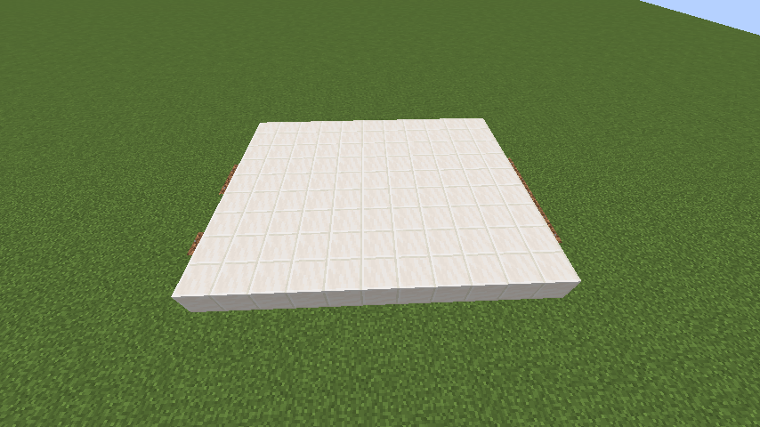](./images/dodai1.png)  [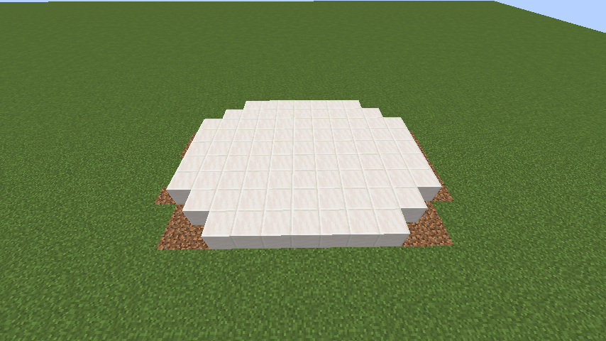](./images/dodai_1.png)

  **※二段目が見やすいように一段目を黒曜石に置き換えています。**
  
[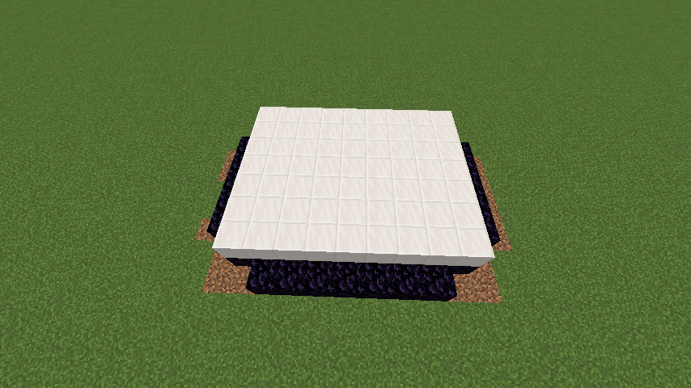](./images/dodai2.png)  [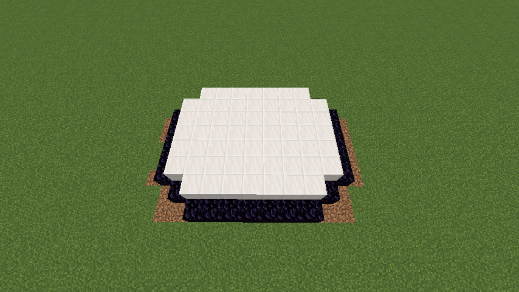](./images/dodai_2.png)

### ネザーゲート

  次にネザーゲート部分を生成します。
  
  言い忘れていましたが、生成する部分が変わると、その都度生成している部分の名称がチャット欄に出てきます。

  [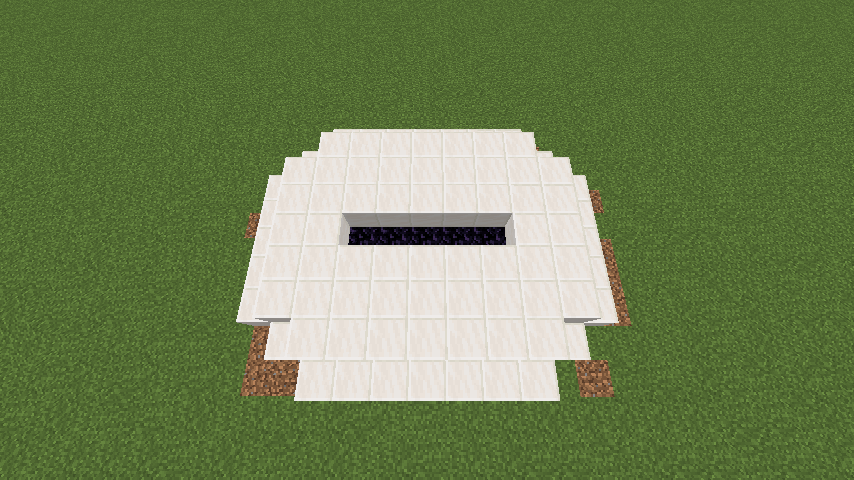](./images/np_d.png)

  **※ネザーゲートとして成立しなくなるため、一つ上にある邪魔なクォーツブロックを消しています。**

  [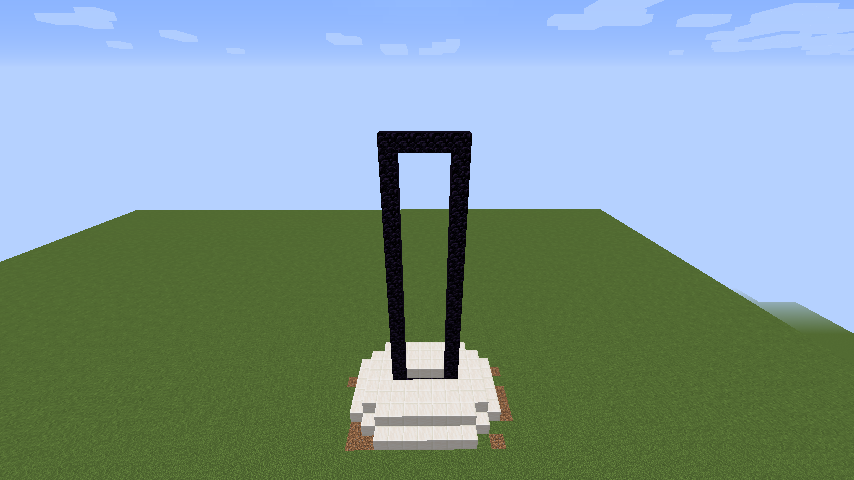](./images/np_perfect.png)

### 刃

  続いては刃の装飾です。ちなみにですが、さらっとネザーゲートの角が閃緑岩に置き換わっています。

  [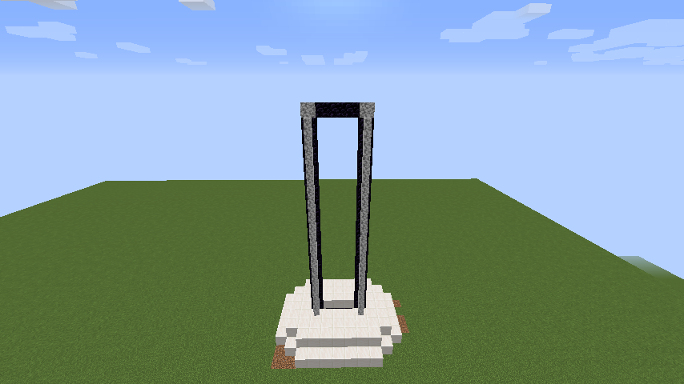](./images/sword.png)

### 鍔

  次に鍔です。ここはごちゃっとしていて、規則性がないので、一個一個 setBlock で置いています。

  [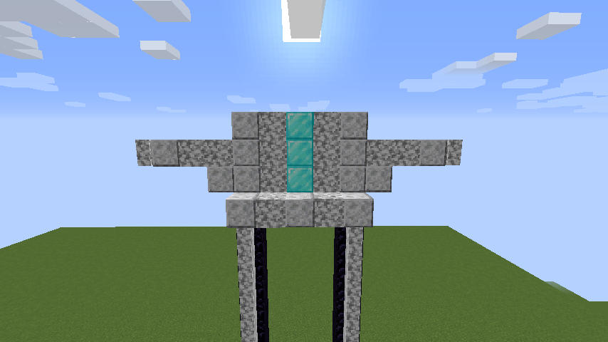](./images/tuba.png)

  **ここは規則性があるからちょっと楽w**

  [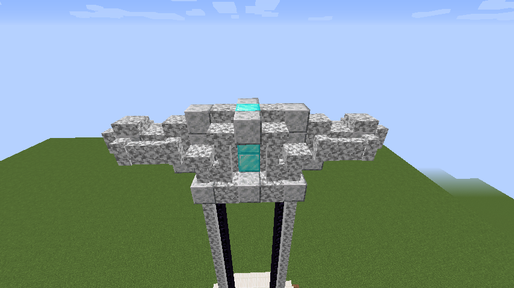](./images/tuba_perfect.png)

  **一個一個置くプログラム、大変だった**

### 柄

　最後に柄です。剣の持ち手ですね。

 ちなみにちょくちょく閃緑岩の塀が先取りして置かれているのは、塀をsetBlockで置くと、隣接したブロックと繋がってくれないからです。

 [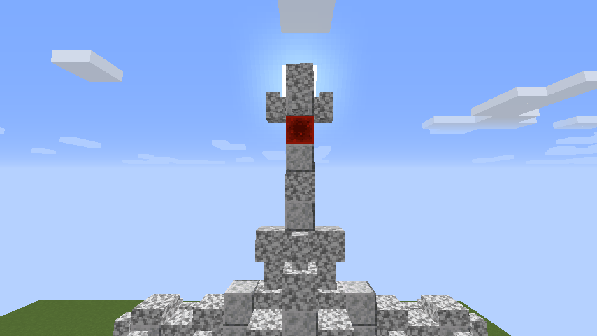](./images/e.png)

 [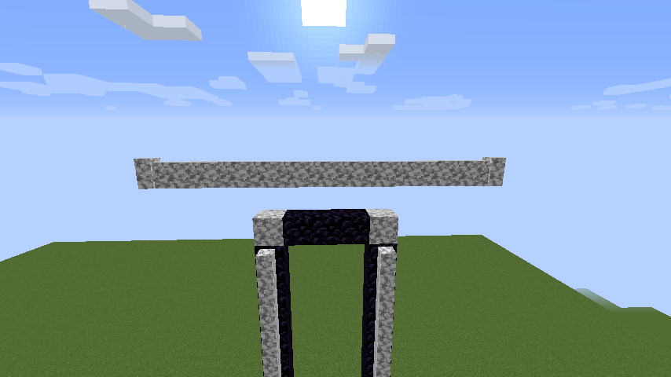](./images/sakidorishitahei.png)

 **先取り塀**
 
 

 **これで隣の磨かれた閃緑岩と繋がってくれる**

 ちなみにこれと同じタイミングでこんなものも置かれています。

  [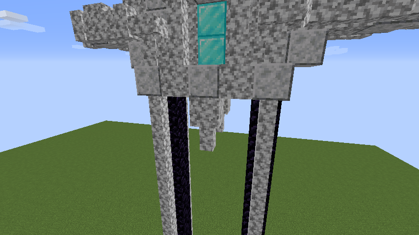](./images/tabun_shokennjya_kizukan.png)

 ### 開門！！

   忘れていました！本当の最後にネザーゲートを開門させます。開門は単純で、黒曜石の上にただ炎を置いただけです。

   これでカッコいいネザーゲート、ネザーゲートソードの完成です。

   [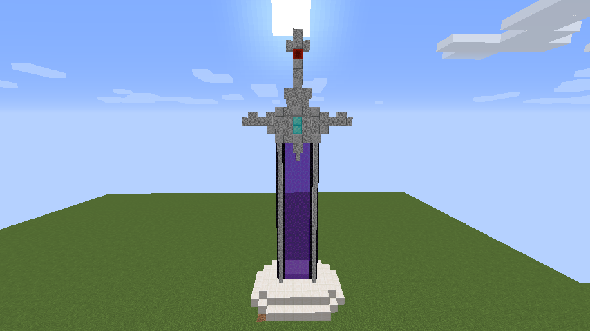](./images/nps_perfect.png)

## ネザーゲートソードの消し方

  nether_potal_sword_clearでネザーゲートソードの消去が可能です。

  ただ消すだけでは面白くないので、一度グロウストーンで埋めてから、上から徐々に消えるようにしました。

  [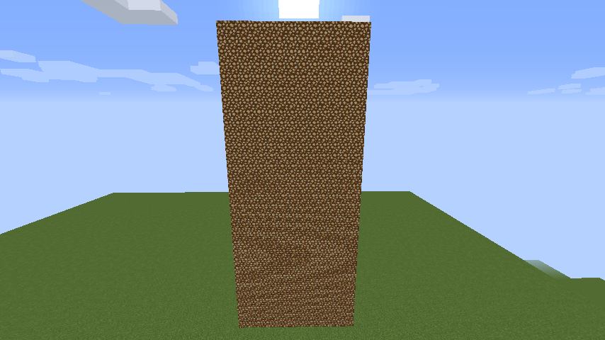](./images/clear.png)  [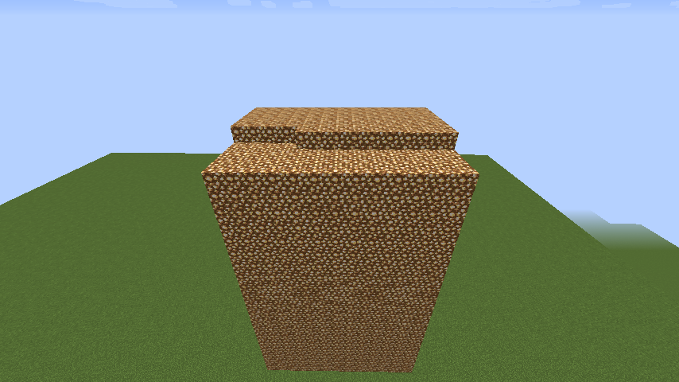](./images/clear2.png)

## Ⅳ.参考文献

https://www.youtube.com/@Seicraft

https://www.youtube.com/watch?v=66E5O9rn4Vs
