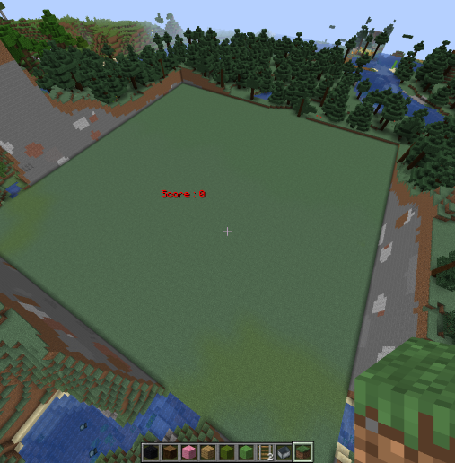

# Development of original API　～Creepar's face～
#### [\日本語版はこちらから/](https://github.com/harimanjuu/minecraft_remote_itkids/blob/main/itkids_m5/api_06_RS_Harimanjuu/README_JAPANESE.md)
#### I am a Japanese.　I am not good at English, so I use a translator. So there may be some oddities. Please understand.
## 1. What this API can do

   **This API is specialized in making creeper's faces**
   - Specify the location of the creeper
   - Specifying the creeper's expression
   - Specify the number of creepers
   - Designation of creeper skin and face color
## 2. What this API can not do

   **There is not much that can be done yet. These are just some of the items that need to be improved in the future**
   * Specify creeper orientation
   * Building a creeper's body
   * Make something other than a creeper
   * Move installed creepers
  
## 3. Let's try!!
   
   In the meantime, let's try different things, referring to what can and cannot be done.
   If it's just a face, it's more flexible than you might think.
   So there are probably quite a few things you can do.  
   So let's go!


  Keep it clean. It is surprisingly important.
  (If you want to reset, run a "[demo1.py](https://github.com/harimanjuu/minecraft_remote_itkids/blob/main/itkids_m5/api_06_RS_Harimanjuu/demo1.py)".)

   


   First, summon one normal creeper.


   

   When placed on the ground, it looks like the item "creeper's head" like this.

   Let's put this side by side. You can connect them, but it is better to leave a little space between them because it is awkward.

   
   
   It consists of repetitive actions. Since we are using list functions, we can also change the face and so on.

   

   They have become much more expressive. (From left to right: surprised face, smiling face, normal face.)

   it while playing. An be arranged horizontally, can they also be arranged vertically?

   

   As expected.Earlier I moved X. If you want to arrange them vertically, just move Y.
   <br>In other words, it is possible to line up creepers in the Z direction...The purpose is to understand the principle, so I'll spare you.

   Finally, let's change the skin color.

   

   The color of facial parts can also be changed.

   I would be happy if you could see that you can do many things with your ingenuity. (we can't make the body though :( )

## 4. クリーパーの作り方
   If you wish to modify the creeper, please modify this program at the bottom of [creeper_test.py](https://github.com/harimanjuu/minecraft_remote_itkids/blob/main/itkids_m5/api_06_RS_Harimanjuu/creeper_test3.py).

   ```
    faces = ["normal"]
    x = 0

    for face in faces:
     set_creeper(mc, x=x, y=y, block_id="green_wool", face=face)
     mc.postToChat(face)
     x += 10 
   ```
   
   ```faces = [...]```
   
   のところはかっこの中に生成したい順番で表情を書いてください。
   <br>上の方に「normal」「smile」などいろいろ載ってます。その言葉通りに入力しないと動作しません。

   x =...が書いてあるところにお好みの座標を入れてあげると、その通りに配置できます。（y,zは省いていますが、追加しても構いません。その場合は、「set_creeper」のカッコ内の「x=x,」の後に「y=y,」と書き足してください。(zも同様です。)）

   ```block_id="..."```　のところでblockの種類を変えることができます。param_MCJE.pyというプログラムから、どんなブロックがあるのか見れるので、そこから選んで```"..."``` の中に書き込んでください。

   ```x += 10``` では、複数クリーパーを作るときにどのくらい間隔をあけるか命令できます。この距離には、クリーパーの体の分も含まれているので、そこは注意しましょう。（クリーパーは8ブロック四方でできています。）

   
   ## 最後に

   このプログラムはマインクラフトをリモートで制御できる環境がある方でないと動かすことができません。<br>詳しくは、<a href="https://github.com/Naohiro2g/minecraft_remote" target="_blank">マインクラフトのリモート制御</a>を参照してください。

   ファイル内のプログラムの概要は[こちらから](https://github.com/harimanjuu/minecraft_remote_itkids/blob/main/itkids_m5/api_06_RS_Harimanjuu/test.md)

   