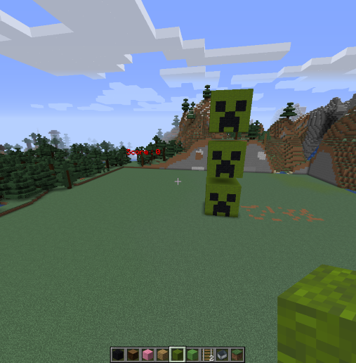
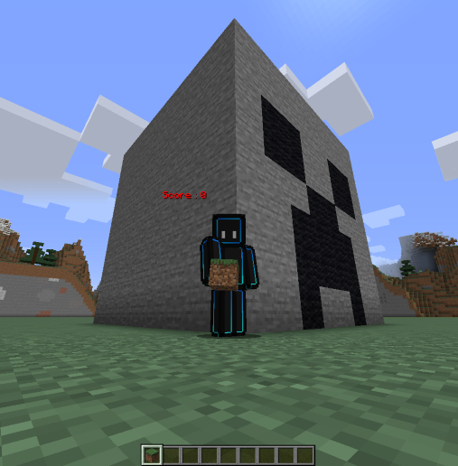

# Development of proprietary APIs　～CREEPER’S FACE～

#### [\日本語版はこちらから/](https://github.com/harimanjuu/minecraft_remote_itkids/blob/main/itkids_m5/api_06_RS_Harimanjuu/README_JAPANESE.md)

#### WARNING
 I am Japanese. So I'm not good at English. Please understand.
## 1. This API can do these

   **You can do this**
   - creeper's position setting
   - creeper's face setting
   - specify the number of creepers
   - creeper's skin and face color setting
## 2. You can not do this

   **This API can do a little things. These are the bad parts**
   * Turn creeper's face around
   * make creeper's body
   * make non-creepers
   * moving creeper
  
## 3. Let's make creeper's!!!! :D
   

   You should clean your world.(please this picture.)This is important thing.(If you want reset, you execution "demo1.py". Let's head to 0,63,0.)


   


   Firstly, let's make a "normal creeper". Run the Sample program as is.

   

   It looks like a "creeper's face"!

   Let's put three of these side by side.
   You should make a gap.

   
   
   This program works by looping. List function is used by this program.


   

   that's nice!!! ;) (WOW!, SMILE and NORMAL)

   I have finally know something.We could put the creeper's face side by side. Maybe, we can also be arranged vertically.


   

   Succesed!!! XD  When I want to put side by side , I changed X-coordinate.So, if we want to be arranged vertically, we change Y-coordinate.It's not difficult.
   <br>In other words, it can also create a line of creepers. But I don't make. Let's try it!! ;)

   Finally,I will change Creeper's skin!

   

   We can change creeper's skin and face parts color .

   I hope you know "you can do many things".（But you cannot make creeper's body! :( ）

## 4. How to make cpeepers
   If you want to play creeper, you use this proglam.

   ```
    faces = ["normal"]
    x = 0

    for face in faces:
     set_creeper(mc, x=x, y=y, block_id="green_wool", face=face)
     mc.postToChat(face)
     x += 10 
   ```
   

   
   ```faces = [...]```
   You write some facial expressions in "[...]".
   <br>I wrote many facial expressions. You must write facial expressions.They are made in the order they are written.


   When you change X-coordinate, the creepers is put that place.

   p.s. 
   You can also set Y-coordinate and Z-coordinate. If you want to set that, let's add "y=y," or "z=z," behind the "x=x".

   ```block_id="..."```　You can set type of block this place.  You can also see many kind of block from "param_MCJE.py", You chese the block and write in ```"..."```.。

   ```x += 10```  You can set creepers spacing. This space includes creeper's width.（Creeper's face is 8 blocks square.）

   
   ## Finally

   These programs cannot run if you don't have Minecraft remote control environment.  
   <br>For more information, see <a href="https://github.com/Naohiro2g/minecraft_remote" target="_blank">Minecraft remote control</a>.

   Program Overview in the file.　<a href="https://github.com/harimanjuu/minecraft_remote_itkids/blob/main/itkids_m5/api_06_RS_Harimanjuu/Program_overview.md" target="_blank">Click me!</a>
   