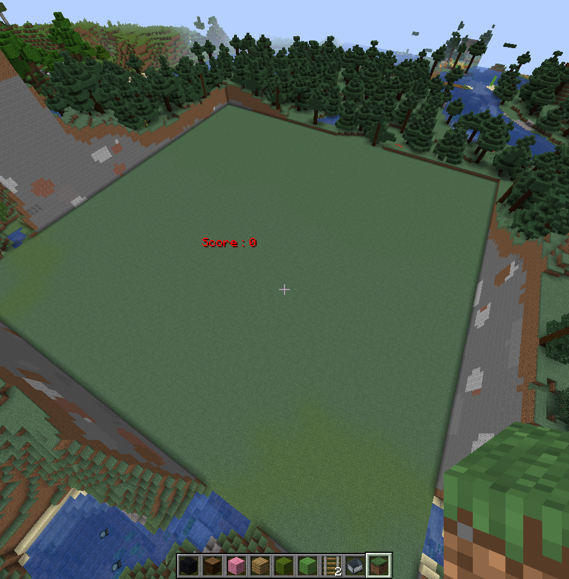
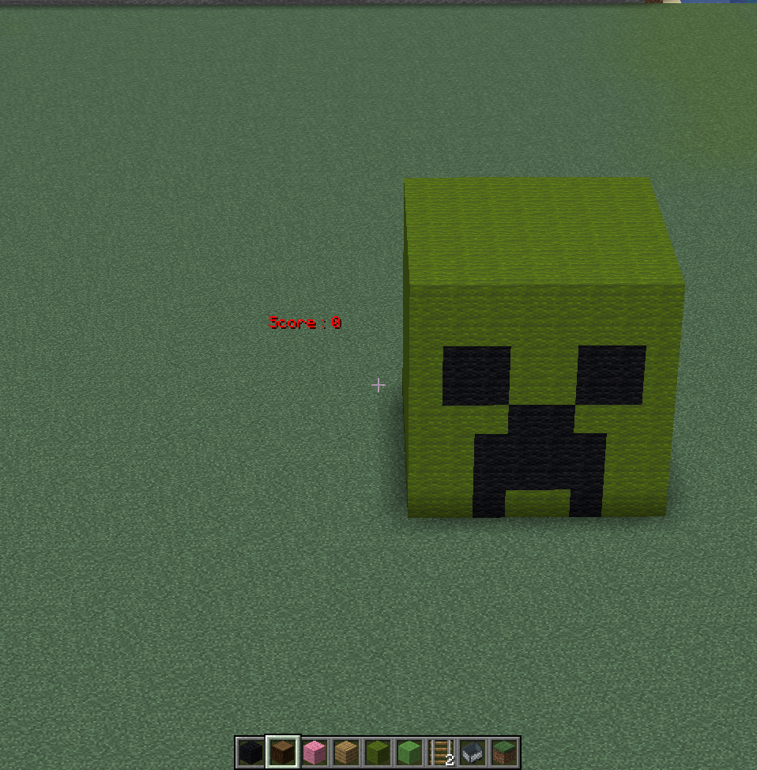
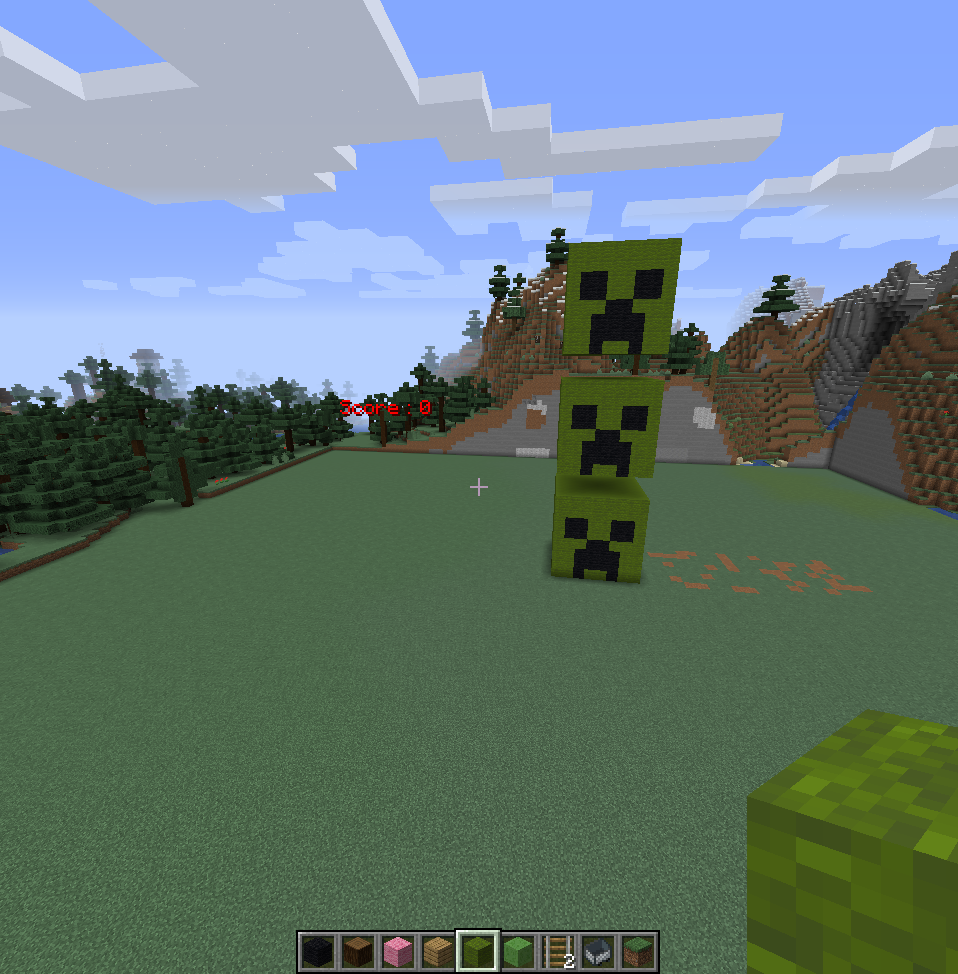
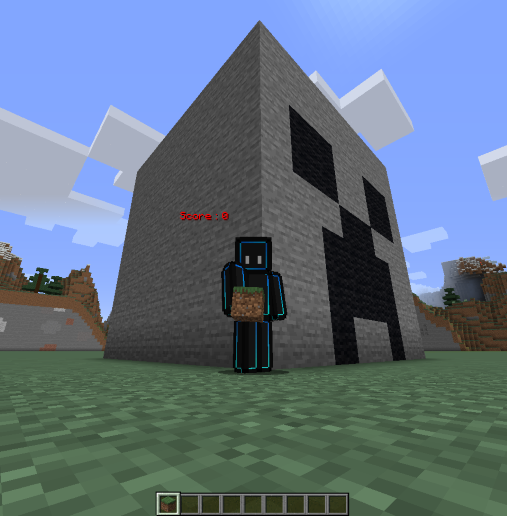

# 独自APIの開発　～クリーパーの顔～
#### [\English here./](https://github.com/harimanjuu/minecraft_remote_itkids/blob/main/itkids_m5/api_06_RS_Harimanjuu/README.md)
## 1. このAPIでできること

   **このAPIはクリーパーの顔を作ることに特化しています。**
   - クリーパーの位置の指定
   - クリーパーの表情の指定
   - クリーパーの数の指定
   - クリーパーの肌?や顔の色の指定
## 2. このAPIではできないこと

   **まだできることは少ないです。これらは今後改善していくべき項目の一部です。**
   * クリーパーの向きの指定
   * クリーパーの体を作ること
   * クリーパー以外のものを作ること
   * 設置したクリーパーを動かすこと
  
## 3. じゃあやってみようではないか
   
   ことは試し、ということで、先ほどのできることできないことリストを参考にいろいろやっていきましょう。  ”顔だけ”ならば意外と自由が利くようにしているので、結構できることあるはずですよね。  ということで、やっていきましょう！！！！


   周りは綺麗にしておきます。これって意外と大事なことなんです。(リセットしたいなら、「demo1.py」を実行しましょう。)


   


   まずはノーマルクリーパー一匹召喚しちゃいましょう


   

   地面の上にぽつんと配置すると、こんな感じでアイテムの「クリーパーの頭」みたいになりますね。

   これを横にポポポ、と並べちゃいましょう。つながっていてもいいのですが、見にくいので今回は少し間をあけます。

   
   
   これは繰り返しの動作で成り立っています。リスト関数を使っているので、顔を変えたりなんかも出来ちゃいます。

   

   随分表情豊かになりましたね。(左から、驚いた顔、ニッコリ、ノーマル。)

   遊んでいる最中に気づきました。横ができるなら、縦に並んだクリーパーもできるのではないだろうか、と。

   

   予想通りですね。さっきはxを移動させていたけど、yを移動させてあげればいい、たったそれだけです。
   <br>てことはクリーパーを奥に並ばせることもできるけど...。原理がわかってくれればいいので今回は割愛します。


   最後に肌も変えてみましょう。

   

   肌の色も変えられるし、何なら顔のパーツの色も変えられます。

   いろいろ遊び放題ってことをわかってくれたらいいと思います。（体は作れないけどね :( ）

## 4. クリーパーの作り方
   クリーパーをいろいろやりたい場合は、一番下にある、


   ```
    faces = ["normal"]
    x = 0

    for face in faces:
     set_creeper(mc, x=x, y=y, block_id="green_wool", face=face)
     mc.postToChat(face)
     x += 10 
   ```

   というプログラムをいじって見てください。
   
   ```faces = [...]```
   
   のところはかっこの中に生成したい順番で表情を書いてください。
   <br>上の方に「normal」「smile」などいろいろ載ってます。その言葉通りに入力しないと動作しません。

   x =...が書いてあるところにお好みの座標を入れてあげると、その通りに配置できます。（y,zは省いていますが、追加しても構いません。その場合は、「set_creeper」のカッコ内の「x=x,」の後に「y=y,」と書き足してください。(zも同様です。)）

   ```block_id="..."```　のところでblockの種類を変えることができます。param_MCJE.pyというプログラムから、どんなブロックがあるのか見れるので、そこから選んで```"..."``` の中に書き込んでください。(「=」の前の名前を書きましょう。)


   ```x += 10``` では、複数クリーパーを作るときにどのくらい間隔をあけるか命令できます。この距離には、クリーパーの体の分も含まれているので、そこは注意しましょう。（クリーパーは8ブロック四方でできています。）

   
   ## 最後に

   このプログラムはマインクラフトをリモートで制御できる環境がある方でないと動かすことができません。<br>詳しくは、<a href="https://github.com/Naohiro2g/minecraft_remote" target="_blank">マインクラフトのリモート制御</a>を参照してください。

   ファイル内のプログラムの概要は[こちらから](https://github.com/harimanjuu/minecraft_remote_itkids/blob/main/itkids_m5/api_06_RS_Harimanjuu/Program_overview_Japanese.md)
   