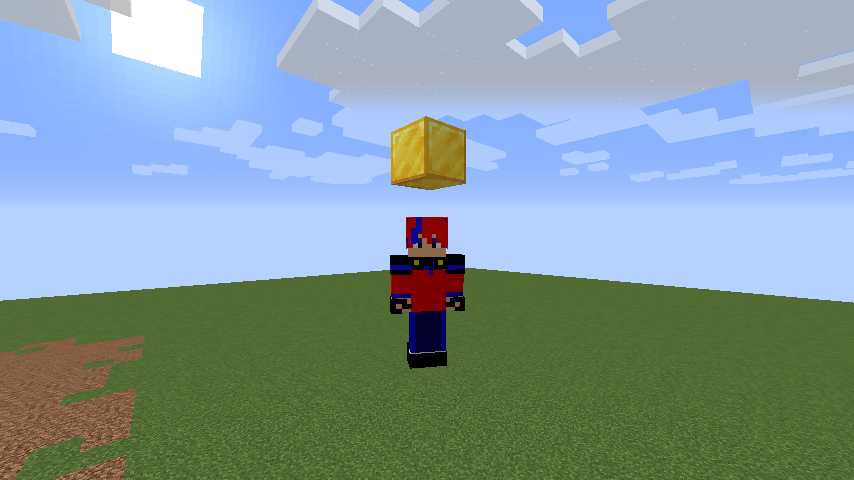
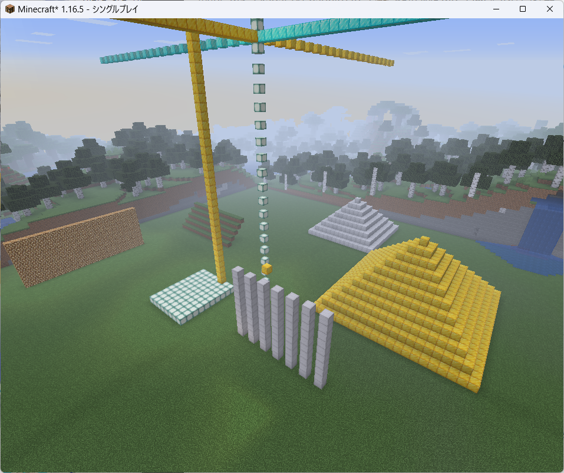

# マイクラ課題

1. 金ブロックをひとつ置く
（x=5, y=70, z=5）
[](./images/kadai1.png)
3. 柱を建てる
（x=5, z=10に、y=63から高さ10で。）
4. 柱を並べて建てる
（x=5, z=10から間隔2で7本。y=63から高さ10で。）
5. 並んだ柱を消す
（空気を置くと消える。）
6. 柱をz方向に寝かせる
（地上y=63に、x=0, z=5から10ブロックで。）
7. 床を作る
（柱をx方向に8本、地上に寝かせる。x=10,z=5から。）
8. 壁、階段を作る
9. ピラミッドを作る

[](./images/kadai.png)

```minecraft
/tp 0 80 0
/time set 0
/weather clear
```

```bash
cd itkids_m5/kadai_00_NT_naohiro2g
ls -la
python hello.py
python axis_flat.py
python kadai_01.py
```
